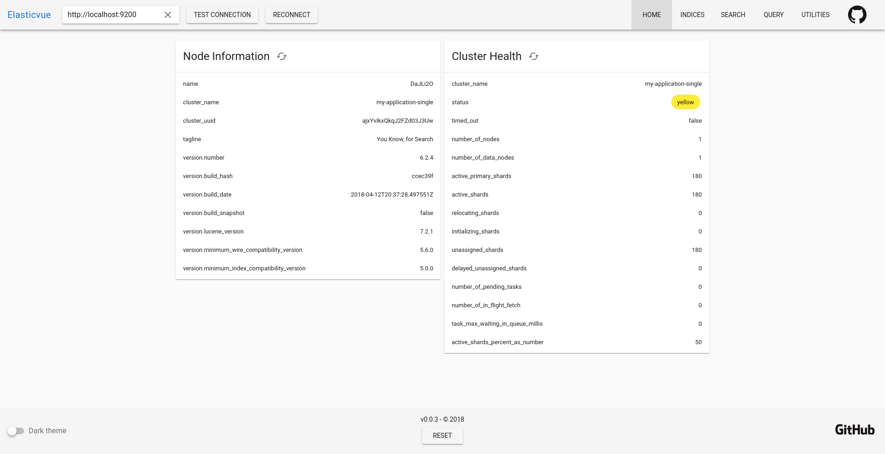

# elasticvue

[](https://travis-ci.org/cars10/elasticvue)
[](https://david-dm.org/cars10/elasticvue)

> Elasticsearch frontend for your browser [https://elasticvue.com](https://elasticvue.com)



Contents

1. [About](#about)
2. [Usage](#usage)
    * [Elasticsearch Configuration](#elasticsearch-configuration)
    * [Running elasticvue](#running)
3. [Browser support](#browser-support)
4. [Tips](#tips)
5. [Comparing with other frontends](#comparing-with-other-frontends)
6. [Development](#development)


## About

**Elasticvue** is a frontend for elasticsearch allowing you to search and filter your clusters data right in your browser.

It works with every elasticsearch version supported by the [official elasticsearch javascript client](https://www.npmjs.com/package/elasticsearch):

* 6.X
* 5.X
* 2.X

### Features

* Cluster overview
* Indices overview, detailed view and index creation
* Searching and filtering documents
* Manually running any query against your cluster
* Utilities, e.g. deleting all indices

## Usage

### Elasticsearch configuration
You have [enable CORS](https://www.elastic.co/guide/en/elasticsearch/reference/current/modules-http.html) to allow connection to your elasticsearch cluster, even if you run the app locally.

Find your elasticsearch configuration (for example `/etc/elasticsearch/elasticsearch.yml`) and add the following lines:

```yaml
# enable CORS
http.cors.enabled: true

# Then set the allowed origins based on how you run elasticvue. Chose only one:
# for docker / running locally
http.cors.allow-origin: /https?:\/\/localhost(:[0-9]+)?/
# online version
http.cors.allow-origin: /https?:\/\/app.elasticvue.com/
# chrome extension
http.cors.allow-origin: /chrome-extension:\/\/[a-z]+/

# or to enable all sources:
http.cors.allow-origin: /(https?:\/\/localhost(:[0-9]+)?)|(chrome-extension:\/\/[a-z]+)|(https?:\/\/app.elasticvue.com)/

# and if your cluster uses authorization you also have to add:
http.cors.allow-headers : X-Requested-With,Content-Type,Content-Length,Authorization
```

Now simply restart elasticsearch and you should be able to connect.

### Running

After configuring use one of the following ways to run elasticvue:

**Online version**

Visit [https://app.elasticvue.com](https://app.elasticvue.com)

**Docker**

Use the existing image:

* `docker run -p 8080:8080 -d cars10/elasticvue` [Image at Docker Hub](https://hub.docker.com/r/cars10/elasticvue) (~50mb compressed)

Or build the image locally:

* Checkout the repo `git clone https://github.com/cars10/elasticvue.git`
* Open the folder `cd elasticvue`
* Build `docker build -t elasticvue .`
* Run `docker run -p 8080:8080 elasticvue`

**Chrome extension**

Install the extension from the [chrome webstore](https://chrome.google.com/webstore/detail/elasticvue/hkedbapjpblbodpgbajblpnlpenaebaa). Start elasticvue by clicking on the icon in your toolbar.

**Run locally**

* Checkout the repo `git clone https://github.com/cars10/elasticvue.git`
* Open the folder `cd elasticvue`
* Install dependencies `yarn install`
* Run a production server via `yarn prod` or dev server `yarn serve`

## Browser Support

Development is done on chrome. Firefox, Safari and Edge should work but are mostly untested.

| IE | Edge | Safari | Firefox | Chrome |
|----|------|--------|---------|--------|
| None | 16+ | 11+ | 50+ | 50+ |

## Tips

* All table filters use fuzzy matching. You can also specify a single column to search in. Examples:

```bash
myquery # search in all columns for "myQuery"
index:myQuery # only search the "index" column for "myQuery"
```

* All select inputs are filterable and use fuzzy matching

## Comparing with other frontends

### [elasticsearch-head](https://github.com/mobz/elasticsearch-head)

pros 

* lightweight
* great query builder

cons

* seems to be unmaintained
* no pagination or sort functionality while browsing data
* no error handling or information to help users
* not all installation methods working for newest version of elasticsearch (docker image for example)


### [dejavu](https://github.com/appbaseio/dejavu)

pros

* maintained
* import/export of data
* cool query builder

cons

* does only provide functionality for browsing data (one index at a time?), nothing more
* no error handling or information to help users


### [kibana](https://www.elastic.co/de/products/kibana)

pros

* official client by elastic
* integration with elasticsearch services
* does way more then showing your data (for example analytics and cluster management)

cons

* very complex and (in my experience) hard to use


### elasticvue

Elasticvue tries to solve most of the *cons* mentioned above. Namely:

* actively maintained and all deployment methods work with the latest versions of elasticsearch
* tries to be as small as possible. (the chrome extension for example is < 1mb, docker image is half the size of dejavu)
* handles errors and shows help and explanation for users, making it easier to use
* has all features needed to browse a big table of data (pagination, sorting, filtering, sticky table headers, ..)
* shows basic cluster information and provides an interface to run any query against your cluster

## Development

Setup and running

```bash
# clone
git clone https://github.com/cars10/elasticvue.git
cd elasticvue

# install dependencies
yarn install

# serve with hot reload at localhost:8080
yarn serve

# tests
yarn test:unit   # add --watch to watch test files
yarn test:e2e
```

Other commands

```bash
# Linting
yarn lint

# minimized build for production
yarn build
```

Building the chrome extension

```bash
yarn build_chrome_extension 
zip -r elasticvue.zip chrome_extension/*
```

## TODO

Current TODOs, more ore less ordered by importance.

* add more specs
* refactor vuex state to use actions?
* performance - use web workers? wasm? ~~requestIdleCallback~~?
* add logo
* create firefox addon?
* save *all* settings in local storage? add settings overview page?
* data import/export

## License

MIT
