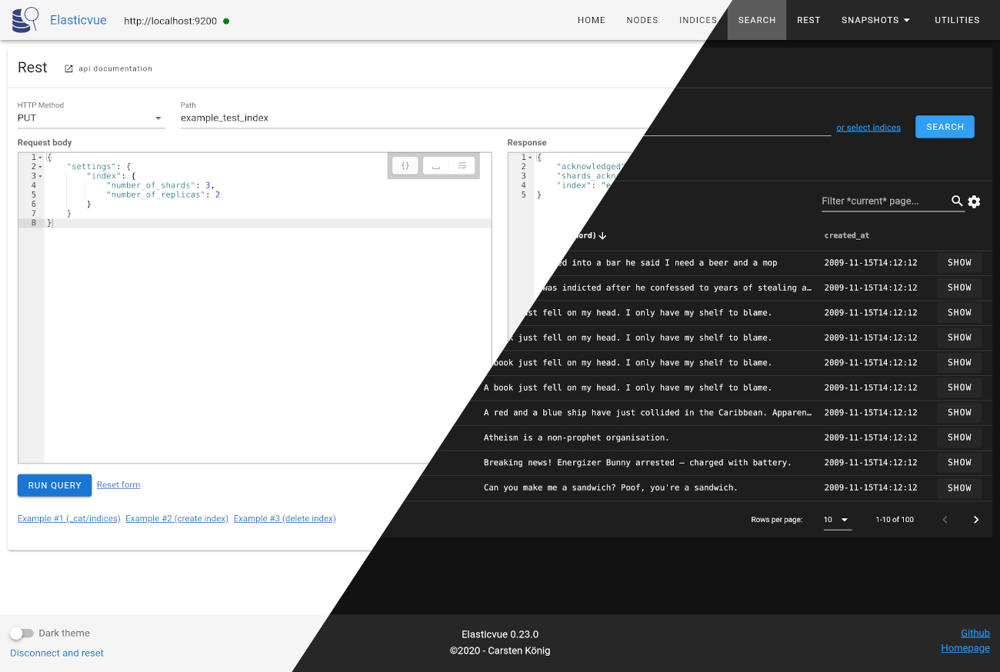

# elasticvue

[](https://travis-ci.org/cars10/elasticvue)
[](https://david-dm.org/cars10/elasticvue)

> Elasticsearch frontend for your browser [https://elasticvue.com](https://elasticvue.com)



Contents

1. [About](#about)
2. [Usage](#usage)
    * [Running elasticvue](#running)
    * [Elasticsearch Configuration](#elasticsearch-configuration)
3. [Browser support](#browser-support)
4. [Comparing with other frontends](#comparing-with-other-frontends)
5. [Development](#development)


## About

**Elasticvue** is a frontend for elasticsearch allowing you to search and filter your clusters data right in your browser.

It officially works with elasticsearch `6.x` and `7.x`. Older versions might or might not work, `elasticsearch-js` will fallback to the `6.6` api if an unsupported version is used.


### Features

* Cluster overview
* Index management
* Searching and filtering documents
* Manually running any query against your cluster
* Snapshot + repository management
* Utilities, e.g. deleting all indices

## Usage

### Running

You can use one of the following ways to run elasticvue:

**Online version**

Visit [http://app.elasticvue.com](http://app.elasticvue.com) or [https://app.elasticvue.com](https://app.elasticvue.com).

**Docker**

Use the existing image:

* `docker run -p 8080:8080 -d cars10/elasticvue` [Image at Docker Hub](https://hub.docker.com/r/cars10/elasticvue) (~50mb compressed)

Or build the image locally:

* Checkout the repo `git clone https://github.com/cars10/elasticvue.git`
* Open the folder `cd elasticvue`
* Build `docker build -t elasticvue .`
* Run `docker run -p 8080:8080 elasticvue`

Then open [http://localhost:8080](http://localhost:8080) in your browser.

**Chrome extension**

Install the extension from the [chrome webstore](https://chrome.google.com/webstore/detail/elasticvue/hkedbapjpblbodpgbajblpnlpenaebaa). Start elasticvue by clicking on the icon in your toolbar.

**Run locally**

* Checkout the repo `git clone https://github.com/cars10/elasticvue.git`
* Open the folder `cd elasticvue`
* Install dependencies `yarn install`
* Run a production server via `yarn prod` or dev server `yarn serve`

Alternatively run `yarn build` and host the assets yourself. Example nginx config:

```
  listen 80;
  server_name yourdomain.com;
  root /var/www/elasticvue_app/dist;
  location / {
    try_files $uri $uri/ /index.html?$args;
  }
``` 

Also see the [official vuejs deployment guide](https://cli.vuejs.org/guide/deployment.html#docker-nginx).


### Elasticsearch configuration
You have [enable CORS](https://www.elastic.co/guide/en/elasticsearch/reference/current/modules-http.html) to allow connection to your elasticsearch cluster, even if you run the app locally.

Find your elasticsearch configuration (for example `/etc/elasticsearch/elasticsearch.yml`) and add the following lines:

```yaml
# enable CORS
http.cors.enabled: true

# Then set the allowed origins based on how you run elasticvue. Chose only one:
# for docker / running locally
http.cors.allow-origin: /https?:\/\/localhost(:[0-9]+)?/
# online version
http.cors.allow-origin: /https?:\/\/app.elasticvue.com/
# chrome extension
http.cors.allow-origin: /chrome-extension:\/\/[a-z]+/

# and if your cluster uses authorization you also have to add:
http.cors.allow-headers : X-Requested-With,Content-Type,Content-Length,Authorization
```

You can also use a regex to enable all sources at once:
```yaml
http.cors.allow-origin: /(https?:\/\/localhost(:[0-9]+)?)|(chrome-extension:\/\/[a-z]+)|(https?:\/\/app.elasticvue.com)/
```

After configuration restart your cluster and you should be able to connect.


## Browser Support

Development is done on chrome. Firefox, safari and edge should work but are mostly untested.

| IE | Edge | Safari | Firefox | Chrome |
|----|------|--------|---------|--------|
| None | 16+ | 11+ | 50+ | 50+ |

## Comparing with other frontends

See the Wiki. [Comparing to other frontends](https://github.com/cars10/elasticvue/wiki/Comparing-to-other-frontends)

## Development

Setup and running

```bash
# clone
git clone https://github.com/cars10/elasticvue.git
cd elasticvue

# install dependencies
yarn install

# serve with hot reload at localhost:8080
yarn serve

# tests
yarn test:unit   # add --watch to watch test files

# for e2e tests you need a running elasticsearch server on port 9123
yarn test:e2e    # add --headless for headless mode
```

Other commands

```bash
# Linting
yarn lint

# minimized build for production
yarn build

# create bundle size report at dist/report.html, dist/legacy-report.html
yarn build --report
```

Building the chrome extension

```bash
yarn build_chrome_extension 
```

## TODO

### 1.0

* document, index, snapshot repo, snapshot edit/delete
* cluster settings
* add more options for snapshot repository creation form
* async table filter (workers, wasm)


### Future

* data import/export

### Internal stuff and refactorings

* add more specs
* refactor vuex state to use actions?
* performance - use web workers? wasm? ~~requestIdleCallback~~?

## License

MIT
